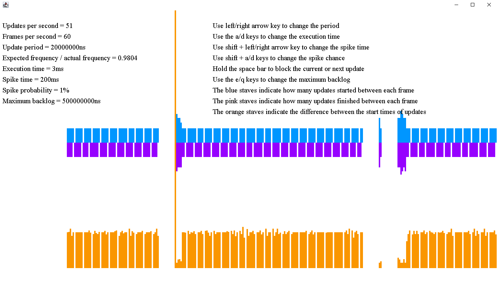

# Update loop
## Handles the timing for game loops and other periodic tasks
### Motivation
Managing game loops properly can be significantly more
complicated than you might expect.
[First of all, should you put your update and render 
functions in the same loop?](./splitting-update-from-render.md).
Furthermore, there are many ways to time your loops, and
[each approach has its own 
drawbacks](./update-loops-overview.md). This mini library
provides a convenient class to handle the timing of game
loops.

### Usage
The usage is best shown using example code:
```java
class SampleGame {
    public static void main(String[] args) {
        long updatePeriod = 50_000_000L; // 50 milliseconds = 50M nanoseconds
        
        new Thread(new UpdateLoop(updatePeriod, updateLoop -> {
            synchronized (gameState) {
                gameState.update();
            }
            if (!shouldContinue) updateLoop.stop();
        })).start();
        
        while (shouldContinue) {
            synchronized (gameState) {
                gameState.render();
            }
        }
    }
}
```
This example would update approximately 20 times per second
and render with maximum FPS. Note that this is not
necessarily the smartest game loop: the parallelization
could be improved significantly with smarter synchronization.

For convenience, this library also provides an `UpdateCounter`
class that can count updates or frames:
```java
class Sample {
    void test() {
        UpdateCounter counter = new UpdateCounter();
        while (shouldContinue) {
            counter.increment();
            render();
            System.out.println("FPS is " + counter.getValue());
        }  
    }
}
```
For demonstration purposes, this project also has a `testbench` [module
](./testbench/src/main/java/com/github/knokko/update/UpdateMonitor.java).


### Add as dependency
Since this library only has 3 small classes, you could just
copy & paste them into your own project. If you prefer
proper dependency management, you can use Jitpack:

#### Gradle
```
...
repositories {
  ...
  maven { url 'https://jitpack.io' }
}
...
dependencies {
  ...
  implementation 'com.github.knokko.update-loop:implementation:v2.0.0'
}
```

#### Maven
```
...
<repositories>
  ...
  <repository>
    <id>jitpack.io</id>
    <url>https://jitpack.io</url>
  </repository>
</repositories>
...
<dependency>
  <groupId>com.github.knokko.update-loop</groupId>
  <artifactId>implementation</artifactId>
  <version>v2.0.0</version>
</dependency>
```